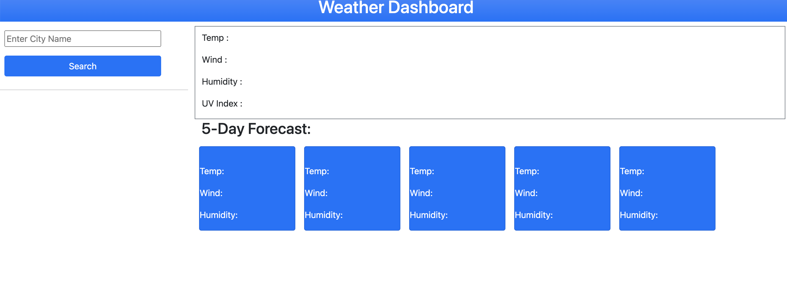
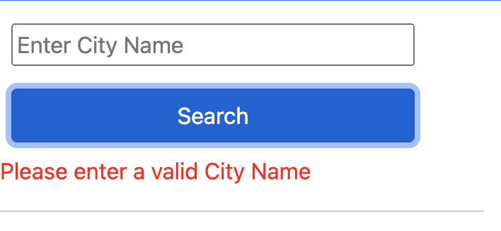
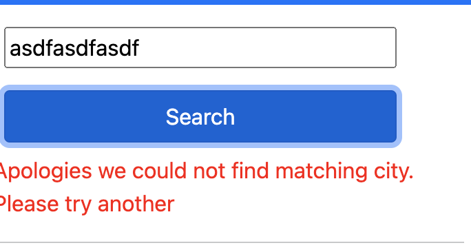
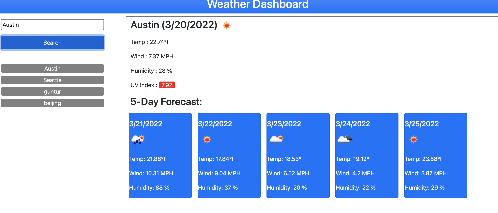
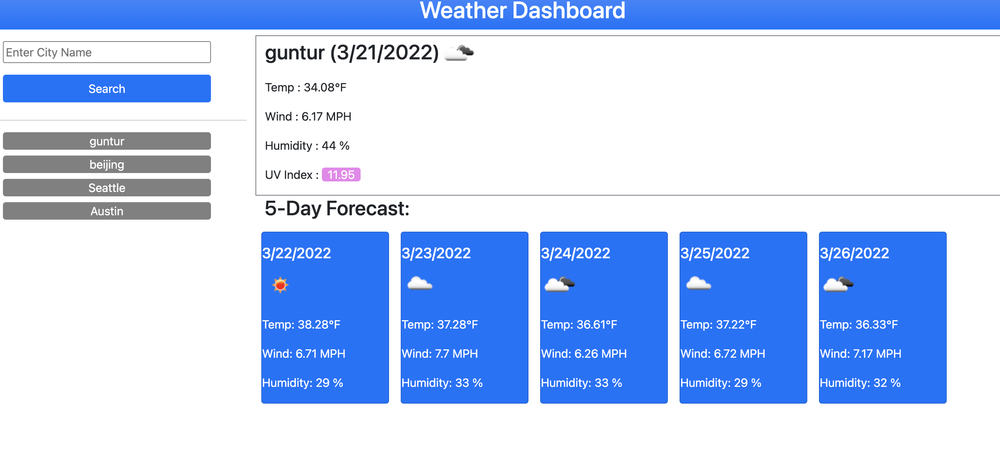

# forecast
a simple weather forecast website, for tracking weather upto 5 days in advance.

# APIs Used:
* Open weather one call [api](https://openweathermap.org/api/one-call-api)
* Open weather geo coding [api](https://openweathermap.org/api/geocoding-api) to get longitude and lattitude.
* Bootstrap framework for styling
* Jquery for DOM manipulation
* HTML for base structuring
* Javascript

# Developer
Ramu Makkena

# Website Live link
[Forecast](https://ramumakkena.github.io/forecast/)

# Imp Notes
* When you are opening the website for first time, all fields will be blank
* After first search, When ever you are opening website, last searched city information will be displayed.
* If you click on previous searches, the latest information will be displayed.

# Some screens
## First Welcome screen

## No City Entered

## City Not found

## Valid Search

## Second welcome
